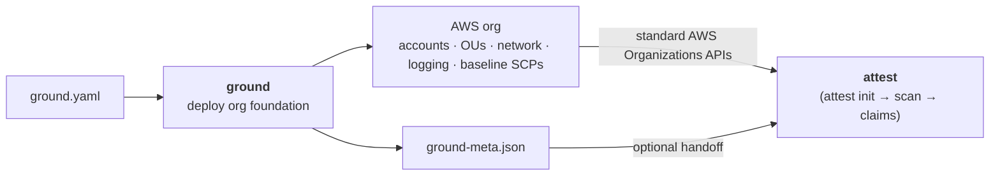

# ground

**SRE deployment foundation for AWS Secure Research Environments**

Part of the [Provabl](https://provabl.dev) suite:
- **ground** — deploy correct AWS foundations ← you are here
- **[attest](https://github.com/provabl/attest)** — compile, enforce, and prove compliance
- **[qualify](https://github.com/provabl/qualify)** — train and qualify researchers

> ground your infrastructure, attest your controls, qualify your people.

---

## What ground does

ground deploys a correctly-configured AWS organization that attest can manage.
It makes **zero compliance claims** — attest makes those after `attest scan`.


```mermaid
flowchart LR
    cfg["ground.yaml"] --> ground["<b>ground</b><br/>deploy org foundation"]
    ground --> org["AWS org<br/>accounts · OUs · network · logging · baseline SCPs"]
    ground --> meta["ground-meta.json"]
    org -->|"standard AWS Organizations APIs"| attest["<b>attest</b><br/>(attest init → scan → claims)"]
    meta -->|"optional handoff"| attest
```

```bash
ground deploy --config ground.yaml   # deploy AWS organization foundation
attest init --region us-east-1        # attest discovers the deployed org
attest frameworks add cmmc-level-2    # activate compliance frameworks
attest compile --scp-strategy merged  # compile policies from frameworks
attest apply --approve                # deploy policies to the org
attest scan                           # NOW we can make compliance claims
```

## Install

```bash
go install github.com/provabl/ground/cmd/ground@latest   # requires Go 1.26.4+
# or build from a clone: go build ./cmd/ground
```

**Prerequisites.** Go 1.26.4+, and AWS credentials for the **Organization management account** (ground
deploys org-wide structure: accounts, OUs, SCPs, logging). It needs Organizations + CloudFormation +
IAM-Identity-Center permissions — run `ground preflight` to verify the calling principal holds them
before `ground deploy`. `ground deploy --dry-run` renders every stack as CloudFormation JSON without
touching AWS.

## Core concepts

The handful of ideas to hold while reading the rest (terms link to the suite [glossary](https://github.com/provabl/provabl/blob/main/docs/guide/glossary.md)):

- **[Organization / OU](https://github.com/provabl/provabl/blob/main/docs/guide/glossary.md#organization--ou)** — ground deploys an AWS org and a tiered OU tree; policies attach to OUs and apply to every account inside.
- **[SCP](https://github.com/provabl/provabl/blob/main/docs/guide/glossary.md#scp-service-control-policy)** — the org-wide guardrails ground ships (logging-protection, AMI gating, the runtime-attestation gates). The coarse half of the suite's two-layer enforcement.
- **[Two-layer enforcement](https://github.com/provabl/provabl/blob/main/docs/guide/glossary.md#two-layer-enforcement)** — ground's SCP is the blunt outer gate; attest's [Cedar](https://github.com/provabl/provabl/blob/main/docs/guide/glossary.md#cedar) PDP is the fine inner decision. ground provides the first, never the second.
- **Foundation, not claims** — ground gets the structure right; **attest** makes the compliance claims, after a scan. (See Trust model below.)

## What it deploys

| Layer | Components |
|---|---|
| Account structure | Management, security/audit, network, shared-services, workload OUs |
| Network | Transit Gateway, hub-and-spoke VPCs, VPC endpoints (org-conditioned) |
| Identity | AWS Identity Center, permission sets (admin/compliance-officer/researcher/auditor) |
| Logging | Org-wide CloudTrail, VPC Flow Logs, Config recorder, centralized S3 audit |
| Security | GuardDuty, Security Hub, Macie — **all enabled by default** |
| Boundaries | Permission boundaries that actually restrict (Deny-scoped, not Allow \*) |
| Tagging | Per-tag enforcement with OR logic (not AND — each missing tag triggers deny) |

## What it does NOT deploy

- Compliance claims (that's attest's job)
- Researcher training (that's qualify's job)
- Framework-specific SCPs (that's `attest compile`'s job)

## Correctness guarantee

Every policy ground deploys is tested before it ships. Permission boundaries, VPC
endpoint policies, and tagging SCPs are verified by policy unit tests — the same
test-driven approach used across the Provabl suite.

## Trust model — what ground does and does not guarantee

Read this before relying on ground for a compliance claim:

- **ground makes zero compliance claims.** It deploys a *correct foundation* (org
  structure, network, logging, baseline SCPs). Whether that foundation *satisfies* a
  framework is **attest**'s judgment, made after `attest scan` — not ground's. ground
  shipping cleanly is necessary, not sufficient, for compliance.
- **SCPs do not restrict the Organization management account.** AWS Service Control
  Policies never apply to the management (payer) account or its root user. Every
  guardrail ground deploys gates *member* accounts; the management account is governed
  operationally, not by these SCPs. Run workloads in member accounts, not the root.
- **The runtime-attestation SCPs gate on tags a producer must write.** The
  enclave/boot-attestation SCPs deny data access unless `attest:enclave-attested` /
  `attest:boot-attested` is present — but ground does not *produce* those tags (nitro/tpm
  do). The gate is only as strong as the producer's attestation and the principal-tag
  integrity behind it.
- **`ground export-iac`: the HCL is complete, the CDK is not.** The Terraform/OpenTofu
  export is *transpiled* from the same CloudFormation templates `ground deploy` submits,
  so it reproduces every resource — OUs, the logging foundation, the SCP **and its
  attachment**, the network, the permission sets — and a resource the transpiler cannot
  represent is a hard error, not a silent omission. The **CDK** export is still a
  hand-written subset: OU hierarchy and permission sets, **no SCP, no logging, no
  network**. Applying it gives the organizational *shape* with nothing enforcing anything,
  which is worse than deploying nothing because it looks finished. Every export states its
  own coverage in-band (stdout banner, header in the generated file, table in its README).
- **What an export changes is state ownership.** A complete HCL export still is not
  `ground deploy`: applying it makes *your* tool the owner of these resources. Do not apply
  it over an org ground already deployed — the OU and SCP names are unique, so you will get
  duplicate-name errors. Import first, or start from an untouched org.

## Exporting to another toolchain

`ground deploy` is CloudFormation-native. If your estate standardises on Terraform or
OpenTofu, export the whole foundation:

```bash
ground export-iac --format terraform   # HCL for the terraform CLI  → ./ground-terraform/
ground export-iac --format opentofu    # the same HCL, for tofu     → ./ground-opentofu/
ground export-iac --format cdk         # TypeScript, CDK v2 (PARTIAL) → ./ground-cdk/
```

Writes files; deploys nothing; makes no AWS API call. The HCL uses only `hashicorp/aws
~> 5.0` with no tool-specific features, so `terraform` and `opentofu` get byte-identical
`main.tf` — both `fmt`- and `validate`-checked in CI, alongside a parity test that compares
the export against the stacks themselves so the two paths cannot drift. The org root and
organization ids come from the `aws_organizations_organization` data source, the same values
`ground deploy` discovers via the Organizations API. `deploy --output` is a deprecated alias.

## Status

🚧 **Under active development.** The CloudFormation deploy path (logging, security,
network, identity, accounts) is the supported one. The Terraform/OpenTofu export is at
parity with it (transpiled from the same templates); the CDK export is a partial subset.

## Open source

ground is fully open source (Apache 2.0) with no commercial tier. It is the structural foundation that [attest](https://attest.provabl.dev) and [qualify](https://qualify.provabl.dev) build on. See [COMMERCIAL.md](COMMERCIAL.md).

## License

Apache 2.0. Copyright 2026 Playground Logic LLC.
